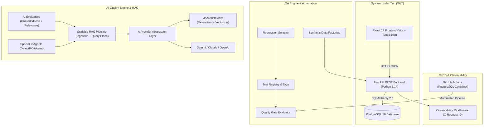
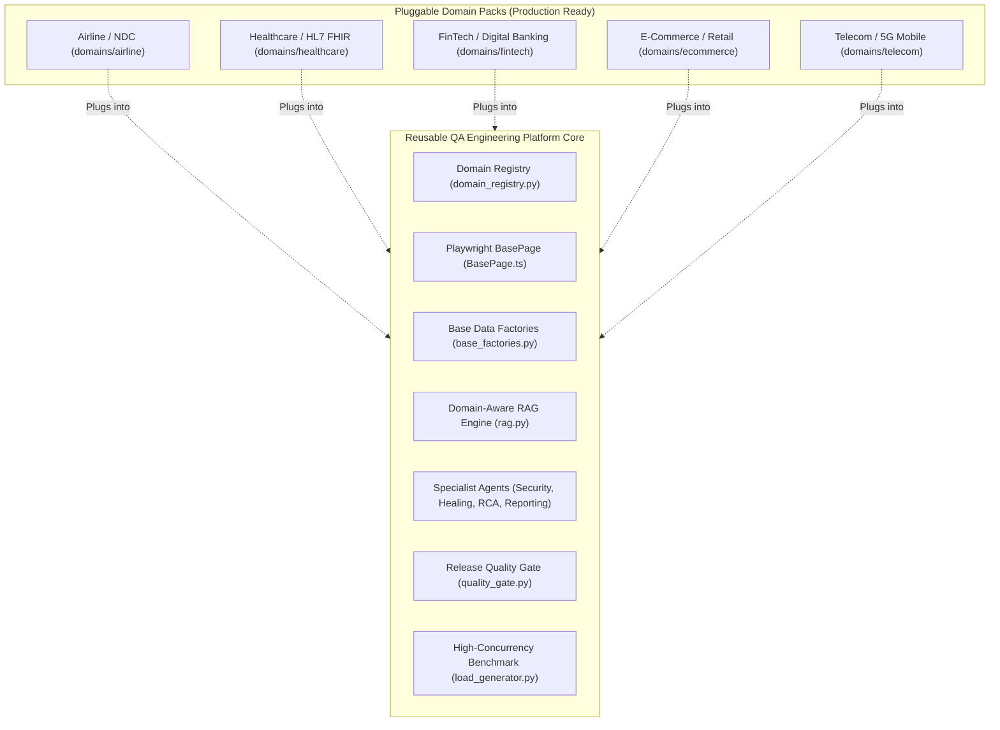

# QA Intelligence Hub — System Architecture

The **QA Intelligence Hub** is a connected Quality Engineering platform designed to demonstrate modern software testing, test automation, AI/RAG quality evaluation, intentional defect engineering, and release governance.

---

## 1. High-Level Architecture Diagram

---

## 2. Component Breakdown

### A. System Under Test (SUT)
* **Domain**: Airline flight search, seat reservations, and payment processing.
* **Authentication & 3DS Payments**: Supports 7 payment methods (`CASH`, `CREDIT_CARD`, `CREDIT_CARD_3DS`, `DEBIT_CARD`, `EASY_PAY`, `UPI`, `WALLET`) with 4 3DS challenge states (`SUCCESS`, `FAILED`, `TIMEOUT`, `CANCELLED`).
* **Database**: PostgreSQL 18 with schema migrations managed via Alembic.

### B. Defect Engineering Engine
* **Controlled Header Ingestion**: `X-Simulate-Defect: <defect-id>`.
* **29 Documented Defects across 5 Production Domains**:
  * **Airline SUT (5 Defects)**:
    * `OVERBOOKING_RACE` (`DEF-001`): Concurrency validation bypass driving available seats negative.
    * `CALCULATION_DRIFT` (`DEF-002`): Financial itemized vs. total fare arithmetic drift.
    * `STALE_INVENTORY` (`DEF-003`): Distributed cache inconsistency returning inflated seat count.
    * `UPSTREAM_GATEWAY_TIMEOUT` (`DEF-004`): Partner 504 gateway failure simulation.
    * `SCHEMA_CONTRACT_VIOLATION` (`DEF-005`): OpenAPI contract mandatory field omission.
  * **Healthcare Domain Pack (6 Defects)**:
    * `MRN_COLLISION` (`DEF-HC-001`): Duplicate MRN generation under concurrent patient intake.
    * `HIPAA_PII_LEAK` (`DEF-HC-002`): Unmasked patient identifier leakage in observation audit logs.
    * `DOSAGE_OVERFLOW` (`DEF-HC-003`): Pediatric weight-based dosage calculation overflow.
    * `STALE_VITALS_CACHE` (`DEF-HC-004`): Stale heart rate and blood pressure observations.
    * `FHIR_SCHEMA_VIOLATION` (`DEF-HC-005`): HL7 FHIR mandatory resource field omission.
    * `CROSS_DOMAIN_HALLUCINATION` (`DEF-HC-006`): Cross-domain clinical recommendation fabrication.
  * **FinTech Domain Pack (6 Defects)**:
    * `OVERDRAFT_RACE` (`DEF-FT-001`): Concurrent transfer race driving balance below overdraft limit.
    * `PRECISION_LOSS` (`DEF-FT-002`): Floating-point precision truncation in currency conversions.
    * `OFAC_SANCTION_BYPASS` (`DEF-FT-003`): Specially Designated Nationals sanctions filter bypass.
    * `IDEMPOTENCY_DUPLICATE` (`DEF-FT-004`): Gateway timeout re-execution duplicate debit.
    * `ISO20022_CONTRACT_MISMATCH` (`DEF-FT-005`): pacs.008 schema validation failure.
    * `UNMASKED_ACCOUNT_LEAK` (`DEF-FT-006`): Plaintext bank account number exposure in transaction payloads.
  * **E-Commerce Domain Pack (6 Defects)**:
    * `OVERSELLING_RACE` (`DEF-EC-001`): Flash-sale concurrency race permitting inventory overselling.
    * `PROMO_STACKING_EXPLOIT` (`DEF-EC-002`): Promo code discount stacking bypassing promotional policy limits.
    * `PRICE_TAMPERING_INJECTION` (`DEF-EC-003`): Cart payload tampering injecting sub-zero or unauthorized prices.
    * `ORDER_STATE_DESYNC` (`DEF-EC-004`): State machine bypass permitting premature fulfillment on unverified orders.
    * `STALE_CART_INVENTORY` (`DEF-EC-005`): Stale cart hold locks expiring prematurely without notification.
    * `REFUND_DOUBLE_CREDIT` (`DEF-EC-006`): Concurrency race in return processing granting duplicate refund credits.
  * **Telecom Domain Pack (6 Defects)**:
    * `SIM_SWAP_RACE` (`DEF-TC-001`): Race condition during concurrent SIM swap allowing twin active SIMs.
    * `CDR_OVERAGE_MISCALCULATION` (`DEF-TC-002`): Fractional data usage rounded up to whole GBs overcharging customers.
    * `UNAUTHORIZED_ROAMING_LEAK` (`DEF-TC-003`): International roaming CDR processed for non-roaming subscriber.
    * `DOUBLE_BILLING_CDR_RACE` (`DEF-TC-004`): Duplicate CDR submission billed twice due to missing deduplication.
    * `INVALID_STATE_TRANSITION` (`DEF-TC-005`): State machine bypass permitting cancelled or barred line reactivation.
    * `CDR_PII_UNMASKED_LOG` (`DEF-TC-006`): Diagnostic logs exposing unmasked MSISDN and IMSI violating CPNI rules.

### C. AI Engine & RAG Architecture
* **Ingestion Plane**: Document loading, token-aware semantic chunking, L2-normalized vector embeddings.
* **Query Plane**: Cosine similarity top-k retrieval, context assembly, answer synthesis, and citation tracing.
* **Evaluation Plane**: Hallucination scoring (`groundedness`), answer relevance, and retrieval hit-rates.
* **Specialist Agents**:
  * `DefectRCAAgent`: Ingests error logs, classifies root cause, assigns severity, and prescribes remediation actions.
  * `RequirementAgent`: Synthesizes automated test scenarios from natural language requirements.

### D. Multi-Signal Quality Gate
* Evaluates candidate releases against configurable policies (`PRODUCTION_STRICT`, `STAGING_STANDARD`, `DEV_PR_FAST`).
* Analyzes test pass rate, critical defects, contract violations, security findings, and AI groundedness scores to issue `APPROVED` or `BLOCKED` verdicts.

---

## 3. Multi-Domain Architecture & Domain Pack Model

The platform adheres to the **"Build the QA platform once. Plug in the domain. Reuse the engineering"** portfolio principle.

### Key Multi-Domain Rules
1. **Zero Core Duplication**: Playwright, API testing, database verification, RAG evaluation, security scanning, performance benchmarks, and quality gates are implemented **once** in the shared platform core.
2. **Domain Isolation**: Domain-specific business rules, synthetic data models, and regression patterns reside exclusively inside their respective domain pack (`domains/<domain_id>/`).
3. **Pluggable Discovery**: The platform discovers domain packs dynamically through `domain_registry.py` without large `if/else` or `switch` statements.
4. **Dynamic Selection**: The active domain is selected at runtime via the `QA_DOMAIN` environment variable (default: `airline`).
5. **100% Synthetic Data & Public Standards**: All test entities, schemas, and workflows are purely synthetic, adhering to public industry specifications (IATA NDC, HL7 FHIR R4, ISO 20022, FTC E-Commerce, 3GPP Telecom). Zero employer-proprietary code, internal endpoints, or confidential business rules are represented.

---

## 4. End-to-End Portfolio Demonstration Runner (`portfolio_demo.py`)

The platform includes a unified CLI runner (`qa-engine/portfolio_demo.py`) demonstrating all 7 core Quality Engineering capabilities in a single invocation (<300ms latency):
- **Module 1**: Dynamic Multi-Domain Registry & Runtime Switching (Airline, Healthcare, FinTech, E-Commerce, Telecom).
- **Module 2**: Synthetic Test Data Generation across 5 Industry Domain Packs.
- **Module 3**: Intentional Defect Engineering Catalogs (29 total documented defects).
- **Module 4**: Dual-Plane RAG & Groundedness Non-Fabrication Guardrail.
- **Module 5**: Specialist QA Agents (Defect RCA, UI Self-Healing, Reporting).
- **Module 6**: Intelligent Regression Diff Impact Selector.
- **Module 7**: Multi-Signal Release Quality Gate Governance (`PRODUCTION_STRICT`).

For instructions on adding new domains, consult the comprehensive [Domain Extension Guide](docs/domain-extension-guide.md).

---

## 5. Architectural Trade-Offs & Decisions

### Monolithic Modularity vs. Premature Microservices
We purposefully rejected premature microservice decomposition in favor of a modular monolith with strict interface contracts:
- **Fast Hermetic Testing**: Test suites run locally in seconds without distributed network latencies or service orchestration overhead.
- **Atomic Transactions & Invariant Enforcement**: Multi-entity booking and inventory deductions run with PostgreSQL ACID guarantees.
- **Clean Boundaries**: Domain packs (`domains/airline`, `domains/healthcare`, `domains/fintech`) are cleanly isolated and can be extracted into standalone microservices if organizational scale demands it later.

### Separation of SUT and Quality Platform
The synthetic System Under Test (SUT) operates independently of external AI services:
- **Core Invariant**: Core flight booking, checkout, and 3DS payment flows execute reliably even during third-party AI provider outages.
- **Modular AI Extensions**: AI evaluation and specialist agents operate as observability, governance, and analysis layers layered on top of the SUT.

---

## 6. Technology Selection Rationale

| Layer | Chosen Technology | Engineering Rationale |
| :--- | :--- | :--- |
| **Backend** | **Python 3.14 + FastAPI** | Native async concurrency, automatic OpenAPI 3.1 documentation, strict Pydantic v2 data validation, and seamless integration with Python's AI/ML ecosystem. |
| **Database** | **PostgreSQL 18 + SQLAlchemy 2.0** | Enterprise ACID compliance, relational integrity with foreign keys, row-level locking for inventory concurrency, and Alembic version-controlled migrations. |
| **Frontend** | **React 19 + TypeScript + Vite** | Predictable state management, high performance, type safety across component props, and zero build latency (< 200ms). |
| **UI Automation** | **Playwright + TypeScript** | Auto-waiting mechanisms, native multi-browser isolation, network mocking, trace/video diagnostics, and robust Page Object Model support. |
| **API Testing** | **Pytest + TestClient** | Fast execution (~12s for 415 automated backend tests, 475 total with Playwright), composable fixtures, parameterized tests, and JUnit XML reporting for CI gates. |
| **AI Abstraction** | **Provider-Neutral Interface** | Strictly avoids vendor lock-in. Switchable between Google Gemini, Claude, OpenAI, and deterministic offline mock vectorizers without changing business logic. |

---

## 7. AI & RAG Quality Evaluation Strategy

AI quality is evaluated across 10 distinct operational dimensions rather than relying on brittle exact-string checks:
- **Groundedness / Hallucination Detection**: Measures the proportion of answer claims directly supported by retrieved context chunks.
- **Answer Relevance**: Evaluates whether the generated answer directly addresses the query context.
- **Retrieval Metrics**: Quantifies top-k hit rate, recall, precision, and cosine similarity ranking.
- **10-Dimensional RAG Dataset**: Audited across STANDARD, DOMAIN_SPECIFIC, PARAPHRASED, MULTI_STEP, AMBIGUOUS, UNSUPPORTED, ADVERSARIAL, HALLUCINATION_PROBE, CITATION_TEST, and REFUSAL_TEST.
- **Non-Fabrication Refusal**: Enforces truthful refusal when query context is unindexed or outside active domain knowledge.
- **Provider Independence**: `AIProvider` base class allows running tests offline in CI using `MockAIProvider` (deterministic term hashing) while switching to live Gemini or OpenAI in production via environment configuration.

---

## 8. Master Agent Orchestration & Autonomous Quality Governance

The platform features an autonomous closed-loop Master Agent Orchestration layer (`qa-engine/orchestrator.py`):
- **Autonomous Lifecycle**: `DISCOVERY -> PLANNING -> EXECUTION -> EVIDENCE -> SECURITY -> REPAIR -> QUALITY GATE`.
- **Master Capability Inventory**: Dynamic catalog manager (`qa-engine/catalog_manager.py`) discovering and tagging 475 capabilities across 11 layers and 5 domains.
- **Structured Evidence Engine**: Standardized run telemetry records (`qa-engine/evidence_engine.py`) persisted in `.qa/evidence/latest_evidence.json` with commit SHA, pass rate, and assertion traces.
- **Fail-Closed Governance**: Strict policy enforcement (`PRODUCTION_STRICT`) requiring 100% test pass rate, 0 critical defects, 0 security vulnerabilities, and RAG groundedness >= 0.85 before certifying release readiness.
