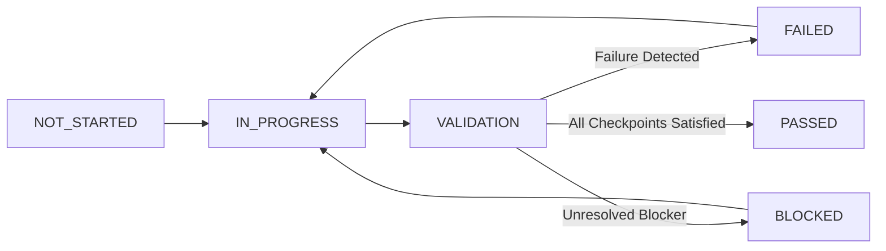

# Task Completion & Definition-of-Done (DoD) Standard

> **Objective**: From now onward, a roadmap task must **NOT** be considered COMPLETE merely because implementation code was generated. A task becomes COMPLETE only when its defined acceptance criteria and applicable validation checkpoints pass successfully.
> 
> Aligns with [AGENTS.md](../AGENTS.md) Section 37 ("Definition of Done") and Section 24 ("Quality Gate"). Machine-readable policy is defined in [.qa/task-checkpoint.json](../.qa/task-checkpoint.json).

---

## 1. Completion Lifecycle States

Every task on the platform roadmap progresses through these discrete lifecycle states:



| Lifecycle State | Criteria & Behavioral Definition |
| :--- | :--- |
| **`NOT_STARTED`** | Task is defined in [docs/ROADMAP.md](ROADMAP.md) with scope, acceptance criteria, and required tests. |
| **`IN_PROGRESS`** | Implementation, test authoring, or configuration is actively underway. |
| **`VALIDATION`** | Implementation is complete; running unit tests, hermetic regressions, quality gate policies, and security checks. |
| **`BLOCKED`** | Validation cannot proceed due to external blockers, missing credentials, or environment unavailability. |
| **`FAILED`** | One or more validation checks failed (e.g. broken tests, linter errors, quality gate violations, security vulnerabilities). Requires remediation. |
| **`PASSED`** | All universal and applicable conditional checkpoints are satisfied with verified evidence. |

> [!IMPORTANT]
> **Strict Completion Rule**: A task in `docs/ROADMAP.md` can **ONLY** be checked off `[x]` when the final validation state is **`PASSED`**. Marking a task complete without executing and passing the checkpoint mechanism is strictly prohibited.

---

## 2. Universal Checks (Mandatory for Every Task)

Every roadmap task must satisfy these universal checks regardless of domain or component:

1. **U1: Implementation & Acceptance Criteria**:
   - Every acceptance bullet point and deliverable specified in [docs/ROADMAP.md](ROADMAP.md) is implemented.
   - Code is modular, clean, typed, and follows repository architectural patterns.
2. **U2: Focused Relevant Tests**:
   - Dedicated unit or integration tests exist covering new functionality or bug fixes.
   - Focused tests pass with 100% pass rate.
3. **U3: Full Hermetic Regression**:
   - The entire test suite (`pytest`) runs and passes with zero test failures (`failure_rate == 0.0`).
4. **U4: Code Hygiene & Linting**:
   - Linters and type validators (`eslint`, `tsc`, `ruff`/`flake8` if configured) pass with 0 errors.
5. **U5: Production Quality Gate (`PRODUCTION_STRICT`)**:
    - Evaluated through [qa-engine/quality_gate.py](../qa-engine/quality_gate.py) under the `PRODUCTION_STRICT` policy tier.
   - Requires: 100% pass rate, 0 failed tests, 0 critical defects, 0 contract failures, 0 security vulnerabilities.
6. **U6: Security & PCI DSS Regression**:
   - Zero critical OWASP vulnerabilities (SQLi, XSS, Prompt Injection, IDOR).
   - Zero unmasked Primary Account Numbers (PAN) or stored CVV codes per PCI DSS Requirement 3.2 and 3.4.
7. **U7: Data Safety & Production Isolation**:
   - All tests execute strictly against isolated local databases (`sqlite:///./test_local.db` or local container).
   - Zero mutations, table drops, or schema alterations executed against production cloud databases (Neon PostgreSQL).
8. **U8: Architecture Invariants**:
   - AI logic remains provider-independent; offline operation functions 100% with `MockAIProvider` and `MockEmbeddingProvider`.
   - Domain logic remains decoupled; no hardcoded domain switches (`if domain == 'airline'`) introduced into core engines.
9. **U9: Git Hygiene**:
   - `git diff --check` passes with zero whitespace or line-ending errors.
   - Working tree is clean (`git status` confirms zero untracked/uncommitted files).
   - Commit uses conventional commit syntax (`feat:`, `test:`, `docs:`, `fix:`, `ci:`).
10. **U10: Documentation & Roadmap Synchronization**:
     - [docs/ROADMAP.md](ROADMAP.md) checkpoint notes and test counts reflect actual verified results.
    - Zero documented features that are not backed by working code and tests.
11. **U11: Zero Unresolved Blockers**:
    - No unresolved blockers, broken imports, or incomplete TODOs directly related to the task.

---

## 3. Conditional Checks (Context-Triggered)

To maintain rapid development without unnecessary overhead, conditional checks are triggered **only** when relevant components are touched:

| Check ID | Verification Area | Trigger Conditions | Required Command / Validation |
| :--- | :--- | :--- | :--- |
| **`C1`** | **Playwright E2E Suite** | Changes to `frontend/**`, `tests/ui/**`, or `playwright.config.ts`. | `npx playwright test` (100% pass, automated teardown verified). |
| **`C2`** | **API Contract Tests** | Changes to REST endpoints in `backend/app/routers/**`, schemas, or `tests/contract/**`. | `pytest tests/contract/test_openapi_contract.py` (0 schema violations). |
| **`C3`** | **AI / RAG Evaluation** | Changes to `ai-engine/**`, domain knowledge docs, or `tests/ai/**`. | `pytest tests/ai/test_production_rag.py tests/ai/test_rag_quality_gate.py` (groundedness $\ge 0.85$, relevance $\ge 0.80$). |
| **`C4`** | **DAST Security Scan** | Changes to API endpoints, authentication, payments, or security logic. | `python qa-engine/security_scanner.py --mode gate` (status `SECURE`, 100% compliance). |
| **`C5`** | **Performance Latency** | Changes to database query paths, flight search, or booking locks. | `pytest tests/performance/test_performance_benchmarks.py` (p95 latency $< 250\text{ms}$). |
| **`C6`** | **Database & Migrations** | Changes to `backend/app/models/**` or Alembic migrations. | `pytest tests/database/test_database_invariants.py` (atomic allocation and rollback tests pass). |
| **`C7`** | **Frontend Lint & Build** | Changes to `frontend/**` (TypeScript/React). | `npm run lint --prefix frontend && npm run build --prefix frontend` (0 errors). |
| **`C8`** | **Backend Python Tests** | Changes to `backend/**`, `qa-engine/**`, `ai-engine/**`, or `domains/**`. | `pytest` (100% pass). |

> [!NOTE]
> **Anti-Fatigue Rule**: Do **NOT** force conditional checks for documentation-only tasks or unrelated components. For instance, updating a markdown document does not require launching a headless browser for Playwright E2E tests.

---

## 4. Executable Checkpoint CLI & Structured Output

The automated task checkpoint evaluator is executed via:

```bash
python qa-engine/task_checkpoint.py \
  --task "Task Name" \
  --junit-xml test-results/pytest-report.xml \
  --security-json test-results/security-dast-report.json \
  --playwright-json test-results/playwright-report.json
```

### Standard Output Format

```text
TASK CHECKPOINT
----------------
Task: Task 6.5: Automated Continuous Security Scanning (DAST) Gate
Status: PASSED
Acceptance Criteria: PASSED
Tests: PASSED (248/248 passed)
Regression: PASSED (100% hermetic pass)
Playwright: PASSED (17/17 passed)
Lint: PASSED (0 errors)
Contract: PASSED (Verified)
Security: PASSED (Zero findings, PCI DSS compliant)
RAG: PASSED (Grounded)
Quality Gate: PASSED (PRODUCTION_STRICT)
Data Safety: PASSED (Local hermetic)
Architecture: PASSED (Provider-independent)
Git: PASSED (Clean working tree)
Documentation: PASSED (ROADMAP.md aligned)
Blockers: None

FINAL STATUS:
PASSED
```

If any check fails, `FINAL STATUS` will report `FAILED` with an actionable list of failures, and exit with code `1`.
